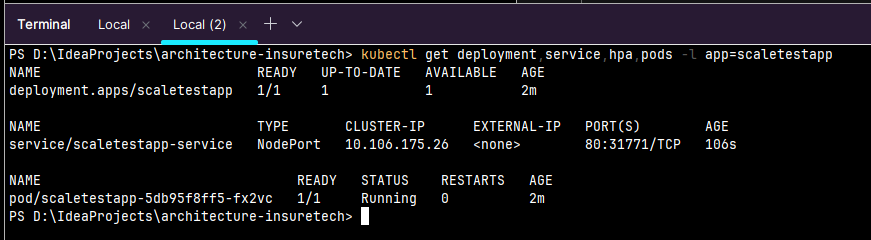
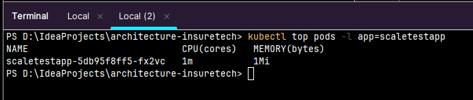
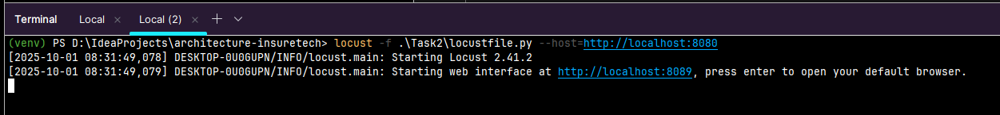
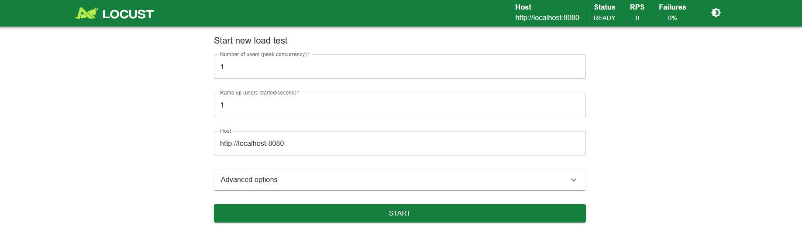
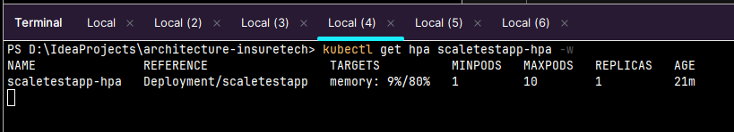
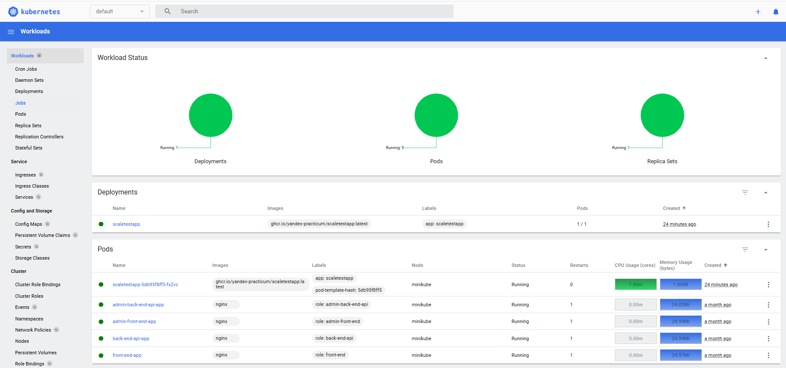
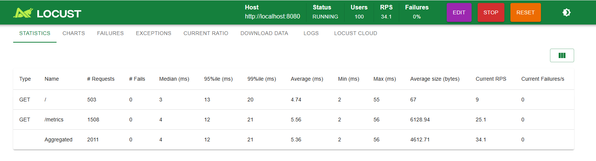
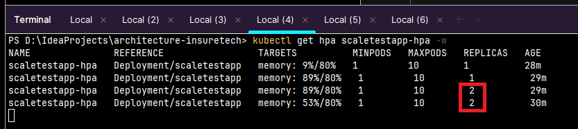
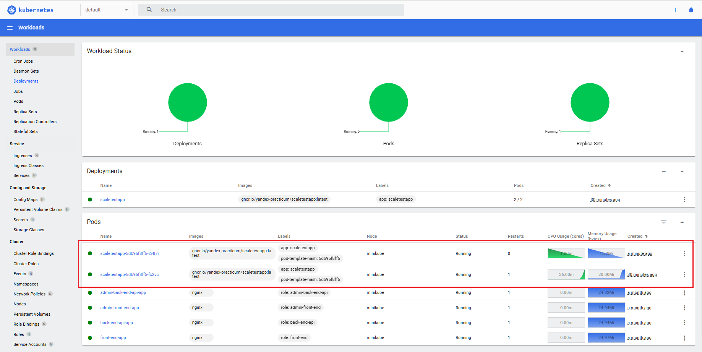

# Задание 2

### Последовательность действий

1) Запуск MiniCube
```shell
minikube start
```

2) Запуск metrics-server
```shell
minikube addons enable metrics-server
```

3) Создан манифест [deployment.yaml](cuber/deployment.yaml)

4) Запуск манифеста
```shell
kubectl apply -f .\Task2\cuber\deployment.yaml
```
5) Создан манифест [service.yaml](cuber/service.yaml)
 
6) Запуск манифеста
```shell
kubectl apply -f .\Task2\cuber\service.yaml
```

7) Проброс порта:
```shell
kubectl port-forward service/scaletestapp-service 8080:80
```

8) Создан манифест [hpa.yaml](cuber/hpa.yaml)

9) Запуск манифеста во втором терминале
```shell
kubectl apply -f .\Task2\cuber\hpa.yaml
```

10) Проверяем все компоненты: во втором терминале запускается:
```shell
kubectl get deployment,service,hpa,pods -l app=scaletestapp
```
В результате в консоли:



Видно, что все компоненты запущены

11) Проверка метрик (во втором терминале):
```shell
kubectl top pods -l app=scaletestapp
```
В результате в консоли:


12) Для работы с приложениями на python нужно создать и активировать виртуальное окружение (во втором терминале):
```shell
virtualenv venv
```
```shell
venv\Scripts\activate
```

13) Установка необходимой зависимости (во втором терминале):
```shell
pip install locust
```

14) Запуск locust (во втором терминале):
```shell
locust -f .\Task2\locustfile.py --host=http://localhost:8080
```

В результате:



15) При переходе по http://localhost:8089 попадаем в ПУ locust:



16) В третьем терминале запускаем дшдборды:
```shell
minikube dashboard
```

17) Для наблюдениями за результатом тестирования в отдельных терминалах запускаем:

4-й терминал (В реальном времени смотрим метрики):

```shell
kubectl get hpa scaletestapp-hpa -w
```

5-й терминал (Смотрим логи пода):

```shell
kubectl logs -l app=scaletestapp -f
```

6-й терминал (Проверяем использование ресурсов):

```shell
kubectl top pods -l app=scaletestapp
```

До запуска тестирования:





18) Запускаю locust с параметрами: 
- Number of users - 500
- Rump up - 10

19) Результаты тестирования:

- В ПУ locust видно, что все запросы успешно выполняются


- В терминале и даждборде видно, что с увеличением нагрузки добавляются новые инстансы приложения:



