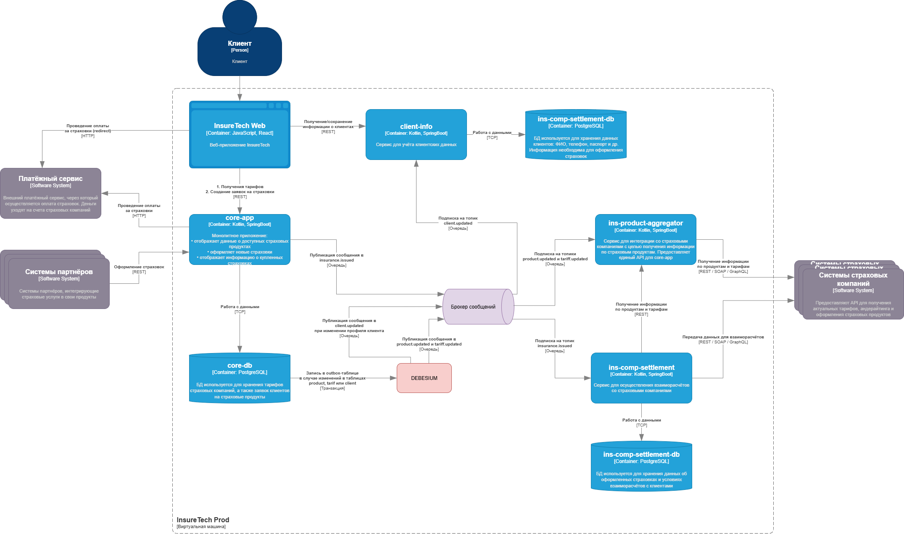

# Проблемы и риски в текущей архитектуре
1) Синхронные вызовы при большом количестве источников
* ins-product-aggregator ждёт ответа от всех страховых компаний, агрегируя данные «на лету».
* При росте числа страховых компаний (с 5 → 10) вероятность таймаутов и деградации по времени ответа увеличивается.
* Если хотя бы одна компания зависнет — задержится весь ответ.
2) Разный график репликации данных
* core-app обновляет продукты каждые 15 минут, ins-comp-settlement — раз в сутки.
* Это приводит к расхождениям: у core-app актуальные данные, у settlement — устаревшие.
* Чем больше компаний, тем больше риск, что nightly batch окажется слишком тяжёлым.
3) Дублирование бизнес-логики и данных
* core-app и ins-comp-settlement хранят копии одних и тех же тарифов.
* При увеличении числа компаний возрастает объём реплицируемых данных, нагрузка на сеть и базы.
4) Чрезмерная связанность сервисов
* settlement зависит от core-app (получает список оформленных страховок через REST).
* При сбое core-app settlement не сможет построить отчёт.
* Нет изоляции при отказах.
5) Невозможность масштабирования pull-модели
* При 10+ компаниях и росте числа продуктов постоянные опросы («pull») становятся дорогими.
* API aggregator будет узким местом.

# Добавление event-driven

Обновленная [C4-схема](InsureTech_C4_event-driven.drawio):

## Event Streaming (Kafka/Redpanda/Pulsar)

1) core-app → ins-comp-settlement
* Сейчас settlement получает список страховок раз в месяц батчем.
* Лучше: core-app после оформления страховки публикует событие insurance.issued (id заявки, id клиента, продукт, стоимость, дата).
* ins-comp-settlement подписывается и накапливает информацию в своей БД. В конце месяца оно может делать агрегацию без запросов в core-app.
2) ins-product-aggregator → core-app
* Сейчас core-app синхронно дёргает aggregator при отображении продуктов и тарифов.
* Проблема: задержка и нагрузка.
* Решение: aggregator публикует события product.updated, tariff.updated, core-app подписывается и обновляет свой кэш/реплику.
3) client-info → core-app
* При изменении профиля клиента core-app должен актуализировать данные.
* Вместо того чтобы core-app каждый раз тянуть API client-info, client-info публикует client.updated.
* core-app подписывается и обновляет свой локальный кэш (или материализованное view).

core-app при создании страховки обновляет свою БД и публикует событие. Если делать publish напрямую в Kafka, возможен split-brain: запись в БД прошла, а событие не улетело.
**Transactional Outbox** решает это: событие пишется в outbox-таблицу в той же транзакции, что и бизнес-запись. Специальный процесс (Debezium или встроенный publisher) считывает и пушит его в Kafka.
Аналогично для client-info и aggregator, когда они публикуют обновления.